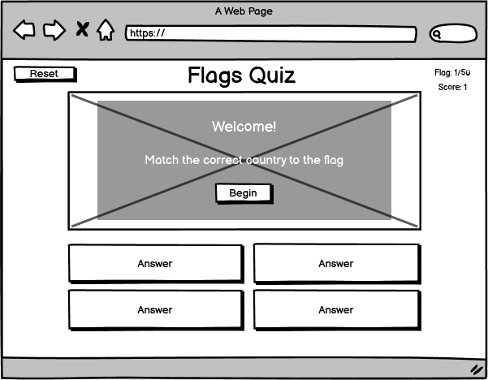
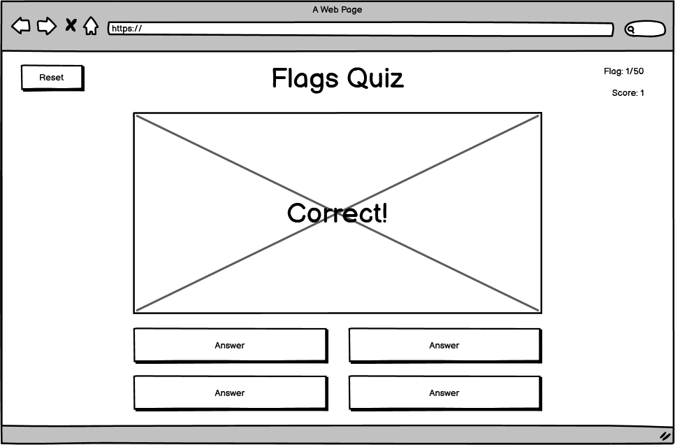
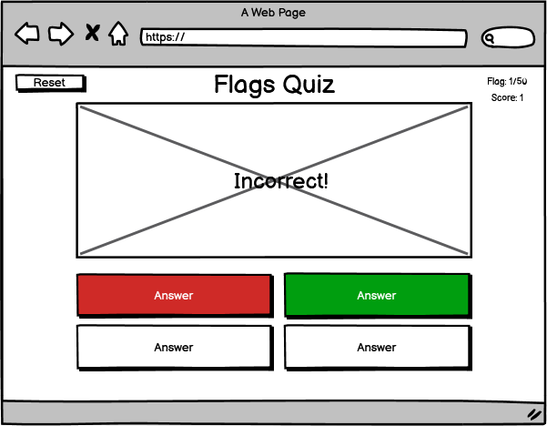
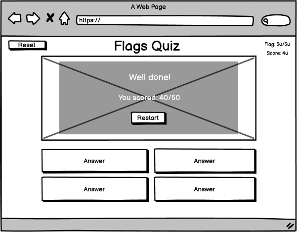
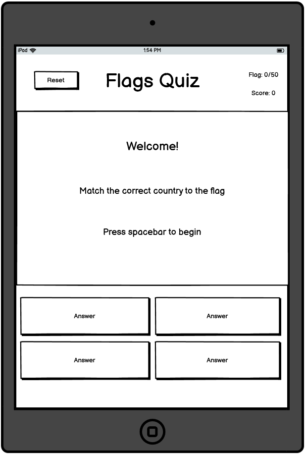
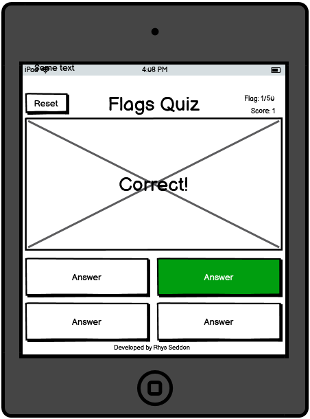
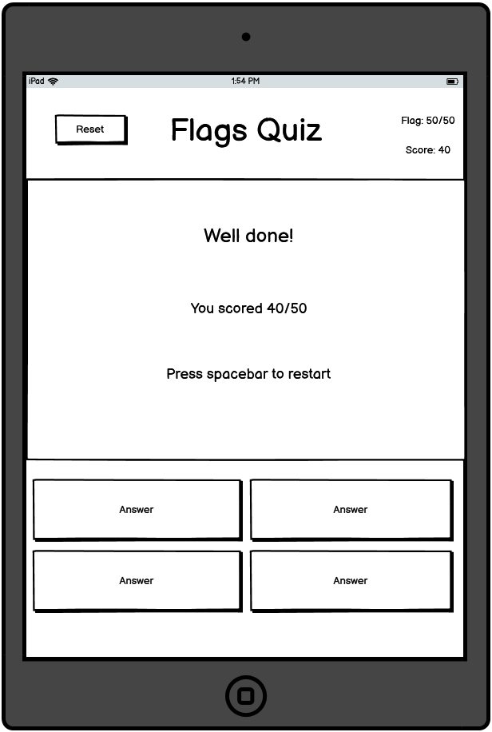
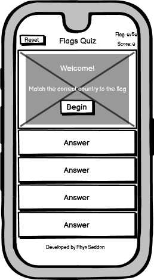
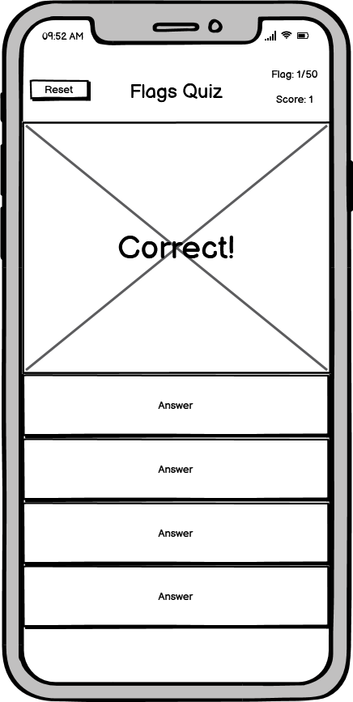

# Flags Quiz

## Purpose

The flags quiz game is a fun and educational tool used to test or improve your knowledge of the world’s flags. A flag is displayed to the user and they will have to input the correct country that the flag belongs to. 
The reason for creating this project is for my second milestone project for a software development course I am undertaking with the Code Institute.

## User Stories

- User 1: I am wanting to learn the flags of the world to improve my geography knowledge.
- User 2: I need to learn the flags of the world as a part of my course and would like to be able to do it easily on mobile phone so I can play it on the train.
- User 3: I am bored and would like to play a game to keep me entertained.

## Strategy

As the site owner my goal is to build a game to make learning the flags of the world a fun experience, as when having fun whilst learning is proven to make students more engaged whilst also helping students retain information better because the process is both enjoyable and memorable. 

The target audience of the game is:

- Students of any age who need to know the flags of the world as part of their curriculum.
- Anyone who has an interest in flags of the world and would like to test or improve their knowledge.
- People who are simply looking for something to do and want to play a game. 

### Research

I researched several sites offering similar quizzes: 

- [https://flagpedia.net/quiz](https://flagpedia.net/quiz)

Pros | Cons      
---|---
Multiple Choice | Questions are too hard
All 254 flags of the world | Too many multiple-choice options
Tells you which answers you get wrong and right |

- [https://online.seterra.com/en/fl/2008](https://online.seterra.com/en/fl/2008)

Pros | Cons      
---|---
Click only - no typing | Not mobile friendly
Keeps a scrore | Requires lots of scrolling
 Has a timer | No reset

 - [https://www.jetpunk.com/quizzes/flags-of-the-world-quiz](https://www.jetpunk.com/quizzes/flags-of-the-world-quiz)

 Pros | Cons      
---|---
Tells you stats on your scores | Requires typing input
Has a reset button | Page looks cluttered
Different levels | Gives all the wrong answers at the end – too much information to remember

### User Expectations
 
 The user should:

 -  Be able to navigate the game easily.
 -	Find playing the game enjoyable.
 -	Expect game to load quickly.
 -	Be able to see their score.
 -	After providing an incorrect answer be able to see correct answer.
 -	Be able to see an end goal, so that the user will keep playing to the end.

## Scope

Based upon the strategy the features and functionality I want to include are as follows:
-   A message to welocome the user.
-	Single page to keep navigation easy.
-	Fun and vibrant colour scheme.
-	4 Multiple choice answers.
-   Current flag counter so the user knows how far they must go to complete the game.
-	Score counter so the user can see how well they are doing.
-	Provides correct answer so the user can learn and answer correctly next time.
-	Reset Button
-	The user should be provided with feedback when clicking the answers so that they know an input has been successfully given and weather it is correct or incorrect.
-   End message to tell the user how well they did and to let them restart.
 
 Functionality to leave out:
-	Different difficulty levels, beyond my current abilities
-	Score stats, beyond my current abilities
-	Not all flags of the world- too much for minimal viable product.

## Structure

The site will need to be suited to a target audience of pretty much any age group so will be structured in a linear format with clean UX keeping the users’ expectations as the main priority.  
The site will be made up of 1 page – the flags will display inside a central conatainer with the 4 clickable answers below and a modal pop up at the start and end of the game.

## Skeleton

The page will consist of: 
- A header which will include a reset button, game title and scores.
- A pop up modal at the start and end of the game.
- A central container which will display the flags.
- 4 buttons below the container for the user to click input the answers.
- A footer which will display the developer information.

### Wiresframes

#### Desktop 

#### Tablet

#### Mobile 

## Surface

### Theme
 
The game will have a old geographical theme which will correspond well with the topic of flags. 
The background picture will need to keep things fun at the same time as not being too distracting.

### Typography
The font used will be ... as it has a geographical old map feel. It will remain the same throughout the site.

### Colour Scheme
The use of vibrant colours to convey a sense of fun and matching in with the geographical theme. The colour of the background shouldn't clash with the colours of the flags.

## Features

### Header

- Reset button on left hand side, with same colour as the bottom multi choice buttons.
- Central title of the game "Flags Quiz".
- On the right side the flag count "Flag: 40/50" and below it the score "Score: 10".

### Central Container 
- Central container which will display the flags and correct/incorrect messages, 75% width on desktop, 100% on tablet and mobile.
- Below the flag four clickable buttons displaying the answers which should be the same colour as the reset button.
 
#### Start Modal
- When the user first enters the site a transparent pop up modal should display within the central container, displaying the centralised text "Welcome!, Match the correct country to the flag" and below a "Begin" button.

#### End Modal
- When the game ends a transparent pop up modal should display within the central container. 
- If the user has a high score it should display the centralised text "Welldone!, you scored: _their score_" and below a "Restart" button.
- If the user has a low score it should display the centralised text "Bad Luck!, you scored: _their score_" and below a "Restart" button.

### Footer
- Should contain small centralised text displaying "Developed by Rhys Seddon"

## Game
### Start
 - When a user enters the site the start pop up modal should display above the first flag. 
 - After the user clicks "Begin", the pop up modal should disappear and the game will begin.

### Playing the Game
1. The first flag should display with the flag count and score both set to 0. 
2. When a correct answer is clicked the clicked button should turn green, a "correct" message should display over the flag and the score and flag count should increase by 1.
3. When a incorrect answer is clicked the clicked button should turn red, and after a 1 second delay the correct answer button should turn green, an "incorrect" message should display over the flag and the flag count should increase by 1.
4. After an correct or incorrect message has displayed on the central container for two seconds the next flag and new set of possible answers should then display.
5. Steps 2 to 4 will repeat until the flag count has reached 50/50.
6. The end modal will display.
7. If the user clicks restart the display will revert back to step 1. 

  

