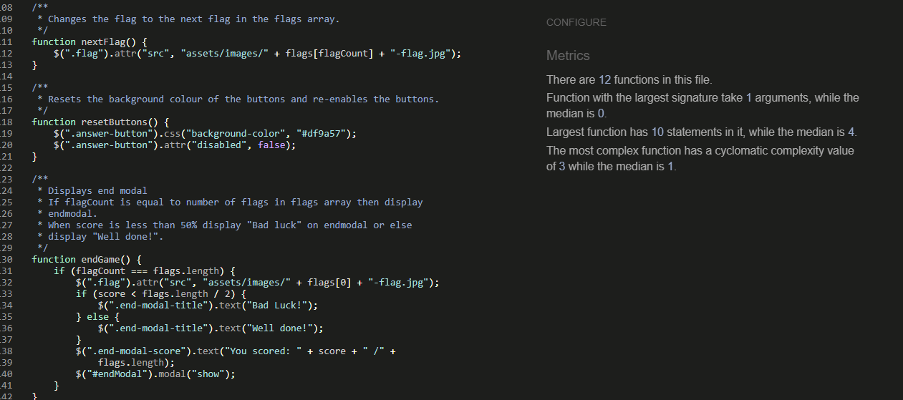
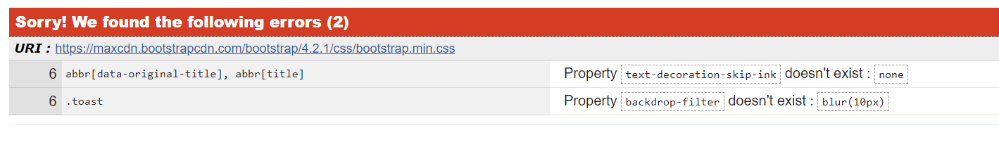
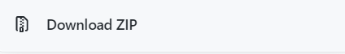

# Flags Quiz

## Contents

* [Purpose](#Purpose)
* [User Stories](#User-Stories)
* [UX](#UX)
    * [Strategy](#Strategy)
    * [Scope](#Scope)
    * [Structure](#Structure)
    * [Skeleton](#Skeleton)
    * [Wireframes](#Wireframes)
    * [Surface](#Surface)
* [Features](#Features)
    * [Implemented Features](#Implemented-Features)
    * [Features To Add Later](#Features-To-Add-Later)
* [Game](#Game)
    * [Start](#Start)
    * [Playing The Game](#Playing-The-Game)
* [Technologies Used](#Technologies-Used)
    * [Languages](#Languages)
    * [Libraries](#Libraries)
    * [IDE And Version Control](#IDE-And-Version-Control)
    * [Tools](#Tools)
* [Testing](TESTING.md)
* [Best Practices](#Best-Practices)
    * [Naming Conventions](#Naming-Conventions)
    * [Code Validation](#Code-Validation)
* [Deployment](#Deployment)
    * [Hosting](#Hosting)
    * [Local Deployment To Browser](#Local-Deployment-To-Browser)
    * [Cloning](#Cloning)
* [Credits](#Credits)
    * [Problems Encountered](#Problems-Encountered)
    * [Images](#Images)
    * [Acknowledgements](#Acknowledgements)

## Purpose
The flags quiz game is a fun and educational tool used to test or improve your knowledge of the world’s flags. A flag is displayed to the user and they will have to input the correct country that the flag belongs to. 
The reason for creating this project is for my second milestone project for a software development course I am undertaking with the Code Institute.

## User Stories
- User 1: "As a visiting user I am wanting to learn the flags of the world to improve my geography knowledge."
- User 2: "As a visiting user I would like to see the number of questions available for me to answer."
- User 3: "As a visiting user I would like to be able to reset the game when I reach the end."

## UX

## Strategy
As the site owner my goal is to build a game to make learning the flags of the world a fun experience, as when having fun whilst learning is proven to make students more engaged whilst also helping students retain information better because the process is both enjoyable and memorable. 

The target audience of the game is:

- Students of any age who need to know the flags of the world as part of their curriculum.
- Anyone who has an interest in flags of the world and would like to test or improve their knowledge.
- People who are simply looking for something to do and want to play a game. 

### Research

I researched several sites offering similar quizzes: 

- [https://flagpedia.net/quiz](https://flagpedia.net/quiz)

Pros | Cons      
---|---
Multiple Choice | Questions are too hard
All 254 flags of the world | Too many multiple-choice options
Tells you which answers you get wrong and right |

- [https://online.seterra.com/en/fl/2008](https://online.seterra.com/en/fl/2008)

Pros | Cons      
---|---
Click only - no typing | Not mobile friendly
Keeps a scrore | Requires lots of scrolling
 Has a timer | No reset

 - [https://www.jetpunk.com/quizzes/flags-of-the-world-quiz](https://www.jetpunk.com/quizzes/flags-of-the-world-quiz)

 Pros | Cons      
---|---
Tells you stats on your scores | Requires typing input
Has a reset button | Page looks cluttered
Different levels | Gives all the wrong answers at the end – too much information to remember

### User Expectations
 The user should:

 -  Be able to navigate the game easily.
 -	Find playing the game enjoyable.
 -	Expect game to load quickly.
 -	Be able to see their score.
 -	After providing an incorrect answer be able to see correct answer.
 -	Be able to see an end goal, so that the user will keep playing to the end.

## Scope
Based upon the strategy the features and functionality I want to include are as follows:
-   A message to welocome the user.
-	Single page to keep navigation easy.
-	Fun and vibrant colour scheme.
-	4 Multiple choice answers.
-   Current flag counter so the user knows how far they must go to complete the game.
-	Score counter so the user can see how well they are doing.
-	Provides correct answer so the user can learn and answer correctly next time.
-	Reset Button
-	The user should be provided with feedback when clicking the answers so that they know an input has been successfully given and weather it is correct or incorrect.
-   End message to tell the user how well they did and to let them restart.
 
 Functionality to leave out:
-	Different difficulty levels, beyond my current abilities
-	Score stats, beyond my current abilities
-	Not all flags of the world- too much for minimal viable product.

## Structure
The site will need to be suited to a target audience of pretty much any age group so will be structured in a linear format with clean UX keeping the users’ expectations as the main priority.  
The site will be made up of 1 page – the flags will display inside a central conatainer with the 4 clickable answers below and a modal pop up at the start and end of the game.

## Skeleton
The page will consist of: 
- A header which will include a reset button, game title and scores.
- A pop up modal at the start and end of the game.
- A central container which will display the flags.
- 4 buttons below the container for the user to click input the answers.
- A footer which will display the developer information.

## Wireframes

### Desktop 

Desktop Modal (Click for image)

Desktop Correct Answer (Click for image)

Desktop Incorrect Answer (Click for image)

Desktop End Modal (Click for image)

### Tablet

Ipad Start Modal (Click for image)

Ipad Correct Answer (Click for image)

Ipad Incorrect Answer (Click for image)

Ipad End Modal (Click for image)

### Mobile 

Iphone Start Modal (Click for image)

Iphone Correct Answer (Click for image)

Iphone Incorrect Answer (Click for image)

Iphone End Modal (Click for image)

## Surface

### Theme
 
The game will have a old geographical theme which will correspond well with the topic of flags. 
The background picture will need to keep things fun at the same time as not being too distracting.

### Typography
The font used will be Cinzel as it has a geographical old map feel. It will remain the same throughout the site.

### Colour Scheme
The use of vibrant colours to convey a sense of fun and matching in with the geographical theme. The colour of the background shouldn't clash with the colours of the flags.

## Features

### Implemented Features

#### Header

- Reset button on left hand side, with same colour as the bottom multi choice buttons.
- Central title of the game "Flags Quiz".
- On the right side the flag count "Flag: 40/50" and below it the score "Score: 10".

#### Central Container 
- Central container which will display the flags, 75% width on desktop, 100% on tablet and mobile.
- Below the flag four clickable buttons displaying the answers which should be the same colour as the reset button.
 
#### Start Modal
- When the user first enters the site a pop up modal should display within the central container, displaying the centralised text "Welcome!, Match the correct country to the flag" and below a "Begin" button.

#### End Modal
- When the game ends a pop up modal should display within the central container. 
- If the user has a high score it should display the centralised text "Welldone!, you scored: _their score_" and below a "Restart" button.
- If the user has a low score it should display the centralised text "Bad Luck!, you scored: _their score_" and below a "Restart" button.

#### Footer
- Should contain small centralised text displaying "Developed by Rhys Seddon"

### Features To Add later
- At a later time an increased amount of flags or questions could be added. Or the user could customise the amount of questions
 with the start pop up modal asking the user how many questions they would like to answer
with a choice of 5 flags, 10 flags, 50 flags or even all 193 flags of the world. 
- A high score feature could be added later where on returning to the site the user can see their highest score from previous games.
- A high score rankings feature could also be added where users can compare their scores with the high scores from other users. 

## Game
### Start
 - When a user enters the site the start pop up modal should display above the first flag. 
 - After the user clicks "Begin", the pop up modal should disappear and the game will begin.

### Playing The Game
1. The first flag should display with the flag count and score both set to 0. 
2. When a correct answer is clicked the clicked button should turn green, after 2 seconds the score and flag count should increase by 1.
3. When a incorrect answer is clicked the clicked button should turn red, and after a 2 second delay the correct answer button should turn green and the flag count should increase by 1.
4. The next flag and new set of possible answers should then display.
5. Steps 2 to 4 will repeat until the flag count has reached the maxiumum number of flags available.
6. The end modal will display.
7. If the user clicks restart the display will revert back to step 1. 

## Technologies Used

### Languages
- Html: Used for the site structure.

- CSS: Used for adding styles to the website.

- Javascript: Used to add the games interactive features.

### Libraries
- Bootstrap 4 : Used for the start and end modals and used the bootstap grid system for responsiveness of the header.

- JQuery: Used to simplify to HTML DOM tree traversal and manupulation as well as event handling and CSS animation. 

### IDE And Version Control
- Gitpod: Used as IDE environment.

- Git: Used for verion control.

- Github: Used for verion control and hosting.

### Tools
- [Google fonts](http://Fonts.google.com) - Used to obtain the Cinzel font.

- [Coolers.co](http://Coolers.co) - Used for help with deciding on colour scheme.

- [www.favicon-generator.org](https://www.favicon-generator.org/search/---/Flag) - Used for creation and implementation of favicon.

- [Jshint.com/](https://jshint.com/) - Used for validation of Javascript code.

- [Validator.w3.org](http://Validator.w3.org) - Used for validation of HTML code.

- [Jigsaw.w3.org/css-validator](http://Jigsaw.w3.org/css-validator) - Used for validation of CSS code.

- [Google.com/test/mobile-friendly](http://Search.google.com/test/mobile-friendly) - Used for testing the website mobile responsiveness.

- Google Chrome DevTools - Used for testing website responsiveness.

## Testing
For the testing page [(click Here)](TESTING.md)

## Best Practices

### Naming Conventions
All names should be relevant and as consistant as possible to enable the reader to understand the coding quickly and efficiently.

- Javacript variables and functions are written in camelCase. 
- Class and IDs are written in lowercase and multi word names are joined with a hyphen.
- File names and image names are written in lowercase and multi word names are joined with a hyphen.

### Code Validation

- Code passed the jsHint validator test with no errors or warnings.

- Code passed the W3 HTML validator on second attempt, after fixing 2 bugs [See fixed bugs](TESTING.md)

- CSS W3 validator had 2 errors. [See outstanding bugs](TESTING.md)

## Deployment

### Hosting
The website is hosted on GitHub pages on GitHub.com, where I save all my repositories. The method I used for deployement was as follows:

- Logged into GitHub.com.
- Opened my repositories.
- Opened my Milestone 2 project repository.
- Under setting tab scrolled to GitHub Pages.
- Under source section selected branch > master and folder > root.
- Upon saving this my website was successfully deployed to [https://rhysseddon.github.io/Flags-Quiz-MS2-Project-/](https://rhysseddon.github.io/Flags-Quiz-MS2-Project-/)

### Local Deployment To Browser 
- Login to GitHub.com.
- Open my repositories.
- Click "code" and "download zip".

- Extract the zip file and once downloaded, open index.html in a browser.

### Cloning
- Login to GitHub.com.
- Open my repositories.
- Click "Code" then under "Clone" copy the link with the HTTPS URL.  

- Go to the terminal in your IDE environment. 
- Change the working directory to where you want the clone to be saved by typing `cd` and the name of the directory.
- Type `git clone` and paste the copied HTTPS URL.
- After pressing enter the clone will be saved to your chosen directory.   

## Credits

### Problems Encountered
- Helped with building a function to change the text value on click and by using the `match` keyword.  
Credit: [Stack Overflow](https://stackoverflow.com/questions/39815945/if-html-text-equals-value-onclick-change)  
Credit: [Stack Overflow](https://stackoverflow.com/questions/14510261/jquery-if-this-contains)
- Used the "Dustenfeld shuffle" to create a function to shuffle the answers.  
Credit:[Stack Overflow](https://stackoverflow.com/questions/2450954/how-to-randomize-shuffle-a-javascript-array)

### Images
- The background image is open source provided by Ylanite Koppens here on [www.pexels.com](https://www.pexels.com/photo/beige-analog-gauge-697662/)
- All the flag images were opensource and taken from here on [www.countryflags.com](https://www.countryflags.com/en/wales-flag-image.html)

### Acknowledgements
- Friends and family for their honest opinions, checking responsiveness on their devices and spell checking!
- Code Institute slack channel @robinz_alumni and @Clint and for their very helpful advice.
- Mentor Rohit Sharma for his excellent guidance and advice.

  

