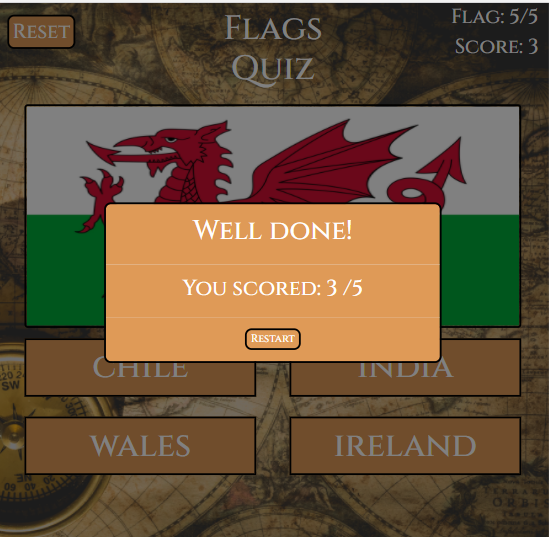

# Testing

## Background Image
- The background image should be displayed at all times.

## Start Modal
- On load a central popup modal should appear over the game.
- The modal should have background colour of `#df9a57` and the font Cinzel.
- The modal should display the centralised text "Welcome!, Match the correct country to the flag" and below a "Begin" button.
- When the begin button is clicked the background colour should flash #5abcb9 and start modal should disappear. 

## Header
- The reset button should display on left hand side, with the background colour of `#df9a57` and the font Cinzel.
- When clicked the reset button background colour should flash #5abcb9 and should reset the game flags, flag count and score. 
- The title of the game "Flags quiz" should display in the centre in the font Cinzel.
- On the right side the flag count should display "Flag: *current flag/Number of flags*" In the font Cinzel.
- Below the flag count the score "Score: *number of times correct answer given* ". In the font Cinzel.

## Start
 - A central container should display a country flag.
 - Below the flag should be 4 buttons they should have the background colour of `#df9a57` and font Cinzel.
 - The buttons should contain the text of 3 random countries and 1 country that matches the flag above. 
 - The text within the 4 buttons should display in a different order every time the page is refreshed and when the reset button is clicked.
 - The flag count should display "Flag: 0/*Number of flags*" and below it the score "Score: 0". 
 
 

## Playing the Game

### Correct Input
- A correct input should be when the button clicked matches the country of the flag displayed in the central container.   
 - When a correct input is given the button that was clicked background colour should turn green.
 - After a 2 second delay, the flag count should increase by 1, the score should increase by 1 and a new flag should appear.

 

### Incorrect Input
 - An incorrect input should be when the button clicked does not match the country of the flag displayed in the central container. 
 - When a correct input is given the button that was clicked background colour should turn red, the button that matches
  the country of the flag displayed in the central container should turn green.
 - After a 2 second delay, the flag count should increase by 1 and a new flag should appear.
 

 

 ## End Modal 

 - Once the flag count has reached the maxiumum number of flags available, the end modal should appear.
- The modal should have background colour of `#df9a57` and the font Cinzel.
- If the users score is less than 50% of the flag count the modal should display the centralised text "Bad Luck!, and below that "You Scored: *Their score*/*Number of flags* "
- If the users score is more than 50% of the flag count the modal should display the centralised text "Well Done!, and below that "You Scored: *Their score*/*Number of flags* "
- Below the text should be a central restart button. 
- When the restart button is clicked the background colour should flash `#5abcb9`, the modal should disappear 
 and the flag count and score should reset to 0 and the first flag should be displayed again. 

### Desktop view

Website should appear as follows on a desktop:

### Tablet View

Website should appear as follows on a tablet (example used Ipad):

### Mobile View

Website should appear as follows on a mobile (example used Moto G4):

## Devtools

The website was extensively tested for responsiveness in google chrome devtools in the following devices:

- Moto G4
- Galaxy S5
- Pixel 2
- Pixel 2 XL
- Phone 5/SE
- Phone 6/7/8
- Phone 6/7/8 Plus
- Phone X
- Ipad
- Ipad Pro
- Surface Duo
- Galaxy Fold

## Browsers

The website was tested for responsiveness on the following browsers:

- Google chrome
- Safari
- Microsoft Edge
- Firefox

## Friends and family

I requested some feedback from friends and family on the how website displays on there devices, so was tested on iphone 7, iphone 8,
 iphone 11, ipad and two laptop with computers one with chrome the other with safari, the website looked good on all of these screen sizes.

## Mobile Friendly Test

- Passed the google mobile friendly test.

## User Story Testing Outcomes

- User 1:  "I am wanting to learn the flags of the world to improve my geography knowledge."

The game is designed in a way to show the different flags to the user aswell as informing them of the answers when they do not know the answer, 
this will improve their knowledge of the flags of the world.

- User 2: - User 2: "I need to learn the flags of the world as a part of my course and would like to be able to do it 
easily on mobile phone so I can play it on the train."

The game is mobile responsive so it will give the user the ability to play the game on the go via their mobile phone.

- User 3: I am bored and would like to play a game to keep me entertained.

The game is has a colourful and clean UX which is entertaining and asks the user if they want to restart at the end of the game which should keep the 
user playing the game. 

## Fixed Bugs
- Encountered some problems with centering the bootstrap modal text and button. Was resolved using the bootstrap class `d block` and the CSS `text-align: center`.  
Credit: [Stack Overflow](https://stackoverflow.com/questions/50041065/bootstrap-4-modal-center-content).
- The jquery selector `:contains` wouldn't implement with a variable, found the solution was to escape the double quotes with single quotes.  
Credit: [Stack Overflow](https://stackoverflow.com/questions/2191419/jquery-contains-with-a-variable-syntax).
- Encountered problems with the on click event listener, when the user clicked multiple times on the answer buttons the flag count and score would increment
 and next flag would change with every click before the next question could render. I found the solution was to disable the answer buttons after they were clicked and enable 
 them again once the next question had rendered, using `$(".answer-button").attr("disabled", true);` and  `$(".answer-button").attr("disabled", false);`
- On the first attempt the HTML validator failed as there was an unnecessary type attribute on the link to the index.js page, and an obselete attribute 
on the start modal, which was copied across form the bootstrap library for the modal.  

## Outstanding Bugs

- CSS validatior had 2 errors both were from the bootstaps CDN so were unable to be resolved.
- JSHint javascript validator showed an undefined varible error ($) which was unable to be resolved as the vaildator test does not recognise the JQuery. 

## Return to [README.md](README.md)