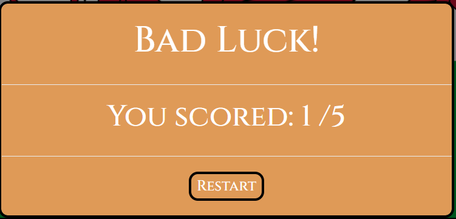
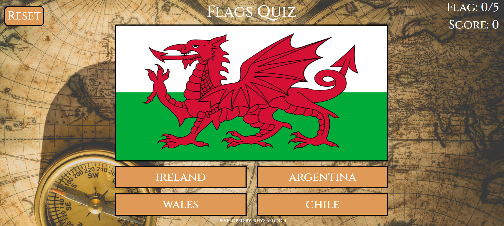

# Testing

## Contents
- [Favicon](#Favicon)
- [Background Image](#Background-Image])  
- [Font](#Font)
- [Start Modal](#Start-Modal)
- [Header](#Header)
- [Start](#Start)
- [Playing the Game](#Playing-the-Game)
- [End Modal](#End-Modal)
- [Desktop view](#Desktop-view)
- [Tablet View](#Tablet-View)
- [Mobile View](#Mobile-View)
- [Devtools](#Devtools)
- [Browsers](#Browsers)
- [Friends and family](#Friends-and-family)
- [Mobile Friendly Test](#Mobile-Friendly-Test)
- [User Story Testing Outcomes](#User-Story-Testing-Outcomes)
- [Fixed Bugs](#Fixed-Bugs)
- [Outstanding Bugs](#Outstanding-Bugs)

#### Return to [README.md](README.md)

## Favicon
- A purple flag must display as the favicon once the page has loaded.

## Background Image
- The background image must be displayed at all times.

## Font
- The font Cinzel must be the only font used thought the site. 

## Start Modal
- On load a central popup modal must appear over the game.
- The modal must have background colour of `#df9a57`.
- The modal must display the centralised text "Welcome!, Match the correct country to the flag" and below a "Begin" button.
- When the "Begin" button is clicked the background colour must flash #5abcb9 and the start modal must disappear. 

## Header
- The "Reset" button must display on left hand side, with the background colour of `#df9a57`.
- When clicked the "Reset" button background colour must flash #5abcb9 and must reset the game flags, flag count and score. 
- The title of the game "Flags Quiz" must display in the centre.
- On the right side the flag count must display "Flag: *current flag/Number of flags*".
- Below the flag count the score must display "Score: *number of times correct answer given*".

## Start
 - A central container must display a country flag.
 - Below the flag must be 4 buttons they must have the background colour of `#df9a57`.
 - The buttons must contain the text of 3 random countries and 1 country that matches the flag above. 
 - The text within the 4 buttons must display in a different order every time the page is refreshed and when the reset button is clicked.
 - The flag count must display "Flag: 0/*Number of flags*" and below it the score "Score: 0". 
 
 

## Playing the Game

### Correct Input
 - A correct input must be when the button clicked matches the country of the flag displayed in the central container.   
 - When a correct input is given the button that was clicked background colour must turn green.
 - After a 2 second delay, the flag count must increase by 1, the score must increase by 1 and a new flag must appear.

 

### Incorrect Input
 - An incorrect input must be when the button clicked does not match the country of the flag displayed in the central container. 
 - When a correct input is given the button that was clicked background colour should turn red, the button that matches
  the country of the flag displayed in the central container must turn green.
 - After a 2 second delay, the flag count must increase by 1 and a new flag must appear.
 

 

 ## End Modal 

 - Once the flag count has reached the maxiumum number of flags available, the end modal must appear.
 - The modal must have background colour of `#df9a57`.
 - If the users score is less than 50% of the flag count the modal must display the centralised text "Bad Luck!, and below that "You Scored: *Their score*/*Number of flags* "
 - If the users score is more than 50% of the flag count the modal must display the centralised text "Well Done!, and below that "You Scored: *Their score*/*Number of flags* "
 - Below the text must be a central restart button. 
 - When the restart button is clicked the background colour smust flash `#5abcb9`, the modal must disappear 
  and the flag count and score must reset to 0 and the first flag must be displayed again. 

## Desktop view

Website must appear as follows on a desktop:

## Tablet View

Website must appear as follows on a tablet (example used Ipad):

## Mobile View

Website must appear as follows on a mobile (example used Moto G4):

## Devtools

The website was extensively tested for responsiveness in Google Chrome Devtools on the following devices:

- Moto G4
- Galaxy S5
- Pixel 2
- Pixel 2 XL
- Phone 5/SE
- Phone 6/7/8
- Phone 6/7/8 Plus
- Phone X
- Ipad
- Ipad Pro
- Surface Duo
- Galaxy Fold

## Browsers

The website was tested for responsiveness on the following browsers:

- Google Chrome
- Safari
- Microsoft Edge
- Firefox

## Friends and family

I requested some feedback from friends and family on the how the website displays on their devices. It was thereby sucessfully tested on iPhone 7, iPhone 8,
 iPhone X, iPad, two makes of laptop computer and one desktop this covered Chrome, Microsoft Edge and Safari. 

## Mobile Friendly Test

- Passed the Google mobile friendly test.

## User Story Testing Outcomes

- User 1: "I am wanting to learn the flags of the world to improve my geographical knowledge."

The game is designed in a way to show the different flags to the user as well as informing them of the answers when they do not know the answer, 
this will improve their knowledge of the flags of the world.

- User 2: "As a visiting user I would like to see the number of questions available for me to answer"

The flag count displays the amount of flags and will increment after every question informing the user how many questions are available to answer. 

- User 3: "As a visiting user I would like to be able to reset the game when I reach the end."

The reset button will allow the user to reset the game at any point and the restart button on the end modal will reset the game at the end. 

## Fixed Bugs
- Encountered some problems with centering the Bootstrap modal text and button. Was resolved using the bootstrap class `d block` and the CSS `text-align: center`.  
Credit: [Stack Overflow](https://stackoverflow.com/questions/50041065/bootstrap-4-modal-center-content).
- The jquery selector `:contains` wouldn't implement with a variable, found the solution was to escape the double quotes with single quotes.  
Credit: [Stack Overflow](https://stackoverflow.com/questions/2191419/jquery-contains-with-a-variable-syntax).
- Encountered problems with the on click event listener, when the user clicked multiple times on the answer buttons the flag count and score would increment
 and next flag would change with every click before the next question could render. I found the solution was to disable the answer buttons after they were clicked and enable 
 them again once the next question had rendered, using `$(".answer-button").attr("disabled", true);` and  `$(".answer-button").attr("disabled", false);`
- On the first attempt the HTML validator failed as there was an unnecessary type attribute on the link to the index.js page, and an obselete attribute 
on the start modal, which was copied across form the Bootstrap library for the modal.  

- When testing I came across the issue that if the user clicked outside of the end modal it would disappear, leaving them with a blank centre container 
and the buttons still clickable and the flag count and score would also increase when the buttons were clicked. To resolve this issue is added the HTML 
` data-keyboard="false" data-backdrop="static"` to the end modal to prevent the click event listener anywhere outside of the "Restart" button.
Credit:  [Stack Overflow](https://stackoverflow.com/questions/16152073/prevent-bootstrap-modal-from-disappearing-when-clicking-outside-or-pressing-esca)

## Outstanding Bugs

- CSS validator had 2 errors both were from the Bootstraps CDN so were unable to be resolved. 

### Return to [README.md](README.md)